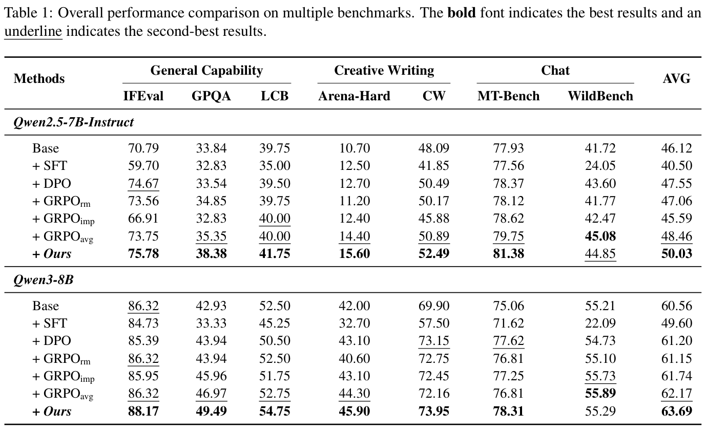
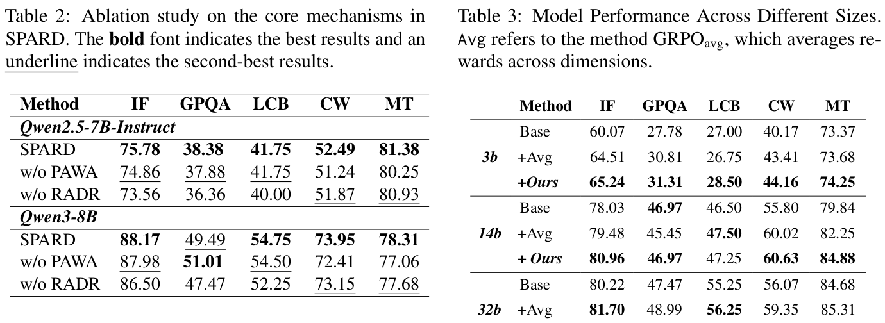

# SPARD: Self-Paced Curriculum for RL Alignment via Integrating Reward Dynamics and Data Utility

[](https://ustc-starteam.github.io/SPARD/)
[](https://arxiv.org/abs/2604.07837)
[](https://www.python.org/)

Official code for **"SPARD: Self-Paced Curriculum for RL Alignment via Integrating Reward Dynamics and Data Utility"**.

SPARD builds an automated self-paced curriculum for reinforcement learning alignment. It adapts multi-objective reward weights according to learning progress and rebalances data according to reward-attributed utility, so post-training can better handle non-stationary reward dynamics and heterogeneous training samples.

## 1. Paper

Xuyang Zhi, Peilun Zhou, Chengqiang Lu, Hang Lv, Yiwei Liang, Rongyang Zhang, Yan Gao, Yi Wu, Yao Hu, Hongchao Gu, Defu Lian, Hao Wang, and Enhong Chen. **SPARD: Self-Paced Curriculum for RL Alignment via Integrating Reward Dynamics and Data Utility.** arXiv:2604.07837, 2026.

[Paper](https://arxiv.org/abs/2604.07837) / [PDF](https://arxiv.org/pdf/2604.07837) / [Project Page](https://ustc-starteam.github.io/SPARD/) / [Code](https://github.com/USTC-StarTeam/SPARD) / [Citation](#citation)

The paper targets open-ended post-training settings where fixed reward weights and static data mixtures struggle. SPARD synchronizes reward emphasis and data utility through progress-aware weight adaptation and reward-attributed data rebalancing.

## 2. Highlights

- Dynamically adjusts reward weights from observed performance gains.
- Rebalances data by aggregating reward importance through a reward-attribution matrix.
- Integrates with `verl`-style RL training infrastructure.
- Supports evaluation with a hosted or local judge model service.

## 3. Method At A Glance


The framework contains two synergistic mechanisms: **Progress-Aware Weight Adaptation** for reward weights and **Reward-Attributed Data Rebalancing** for data weights. Together, they prioritize the current learning objectives and the most useful data.

## 4. Repository Structure

```text
.
|-- datasets/              # Released GRPO data
|-- figures/               # Paper figures
|-- scirpts/               # Training/evaluation shell scripts (kept as released)
|-- spard/                 # Training framework and dependencies
`-- docs/                  # Project page and README assets
```

## 5. Installation

The released training stack is based on `verl`-style RL infrastructure. Install the dependencies required by the nested `spard/` framework and prepare a judge model endpoint for evaluation.

## 6. Data / Models

The repository includes `datasets/grpo_data.jsonl` as released data. For evaluation, configure either a hosted API or a locally deployed judge model service.

## 7. Quick Start

Set the judge model environment variables:

```bash
export JUDGE_MODEL=<MODEL_NAME>
export JUDGE_API_KEY=<YOUR_API_KEY>
export JUDGE_API_BASE=<API_BASE_URL>
```

Run the SPARD script:

```bash
bash scirpts/spard.sh
```

## 8. Reproducing Results / Evaluation

The public scripts use DeepSeek-R1 as the judge model in the released setup. You can point `JUDGE_API_BASE` to an official API endpoint or a local service launched with LMDeploy, vLLM, or SGLang.

## 9. Configuration Notes

The released script directory is named `scirpts/` in the repository. Keep this path unchanged unless all script references are migrated together.

## 10. Experimental Highlights





The paper tables above show the overall benchmark comparison, core ablations, and model-size study behind the short conclusions below.


SPARD is designed for multi-objective RL alignment where reward priorities change during training. The paper reports improvements across multiple benchmark domains by jointly adapting reward dynamics and data utility.

| Backbone | Base AVG | Strongest listed baseline AVG | SPARD AVG | Readout |
| --- | ---: | ---: | ---: | --- |
| Qwen2.5-7B-Instruct | 46.12 | 48.46 (GRPOavg) | **50.03** | SPARD improves general capability, creative writing, and chat metrics together. |
| Qwen3-8B | 60.56 | 62.17 (GRPOavg) | **63.69** | The gains persist on a stronger base model. |

The ablation study reports that removing PAWA hurts open-ended generation tasks such as Creative Writing and Chat, while GRPOavg still trails SPARD even though it outperforms scalar reward-model and implicit-reward variants.

**Conclusion:** dynamic reward weighting and data-utility pacing jointly improve multi-objective alignment stability.

## 11. Notes For Maintainers

- Keep large training outputs and model checkpoints outside Git history.
- Store new README/project-page figures under `docs/assets/`.
- Add conference, slides, poster, or video links to the Paper section when official presentation materials become public.

<a id="citation"></a>

## 12. Citation

```bibtex
@misc{zhi2026spard,
  title = {SPARD: Self-Paced Curriculum for RL Alignment via Integrating Reward Dynamics and Data Utility},
  author = {Zhi, Xuyang and Zhou, Peilun and Lu, Chengqiang and Lv, Hang and Liang, Yiwei and Zhang, Rongyang and Gao, Yan and Wu, Yi and Hu, Yao and Gu, Hongchao and Lian, Defu and Wang, Hao and Chen, Enhong},
  year = {2026},
  eprint = {2604.07837},
  archivePrefix = {arXiv},
  primaryClass = {cs.AI},
  url = {https://arxiv.org/abs/2604.07837}
}
```

## 13. Contact

For paper questions, please contact:

- First author: Xuyang Zhi (no verified public email found from the arXiv paper).
- Corresponding authors: Hao Wang (`wanghao3@ustc.edu.cn`) and Enhong Chen (`cheneh@ustc.edu.cn`)

For repository issues, please open a GitHub issue in this repository.
