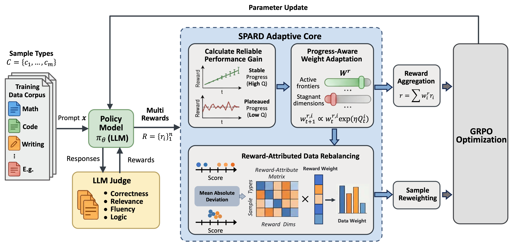

# SPARD
SPARD: Self-Paced Curriculum for RL Alignment via Integrating
Reward Dynamics and Data Utility
## Method
[](figures/method.png)
The framework of SPARD consists of two main synergistic mechanisms: (1) Progress-Aware
Weight Adaptation dynamically adjusts reward weights (wr ) based on the reliability of performance gains, and
(2) Reward-Attributed Data Rebalancing computes data weights (wd) by aggregating reward importance via a
reward-attribute matrix derived from score dispersion. These components jointly guide the optimization to prioritize
current learning objectives and leverage the most efficient data.

## Execution Instructions
For the training process, we used verl for its high efficiency and scalability. We use DeepSeek-R1 as the judge (scoring) model for evaluation. To run evaluation, you need a model service endpoint, either a hosted API (e.g., OpenAI or DeepSeek official API), or a locally deployed service via LMDeploy, vLLM, or SGLang. Then set the environment variables below and run the evaluation scripts:

```bash
export JUDGE_MODEL=<MODEL_NAME>
export JUDGE_API_KEY=<YOUR_API_KEY>
export JUDGE_API_BASE=<API_BASE_URL>
```

Command to execute:
```bash
bash scirpts/spard.sh
```
